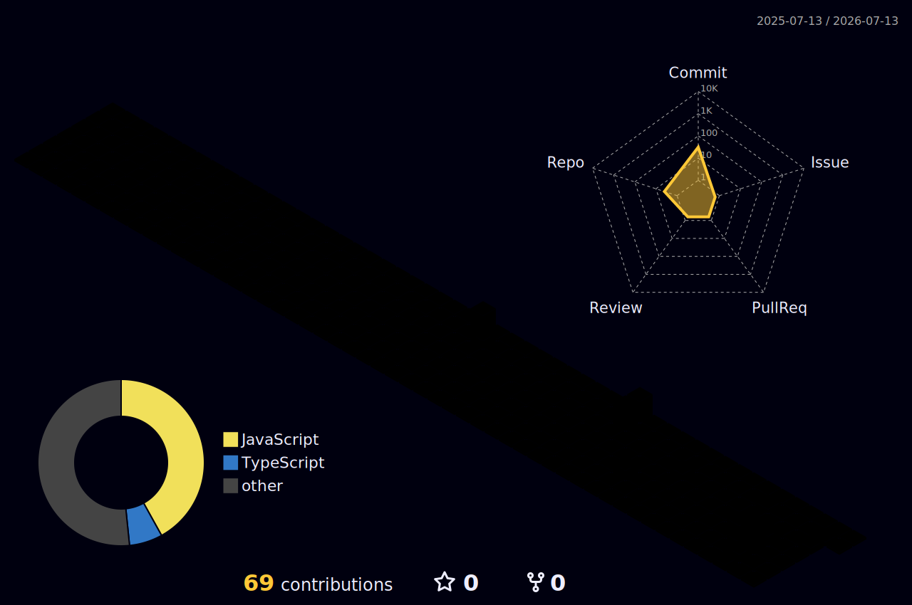

  

<h1 align="center">Hi there 👋, I'm Abdul Qadir Khan</h1>

  

<h3 align="center">🚀 Full Stack Engineer · SaaS Builder · Product-Minded Developer</h3>

  I design and ship <b>SaaS platforms, AI tools & scalable web apps</b> that help businesses launch fast and grow efficiently.

  <a href="https://techhub.cafe/me" target="_blank">🌐 Portfolio</a> &nbsp;•&nbsp;
  <a href="https://techhub.cafe/" target="_blank">✍️ Blog</a> &nbsp;•&nbsp;
  <a href="mailto:aqadirkhan93@gmail.com" target="_blank">📩 Email</a> &nbsp;•&nbsp;
  <a href="https://techhub.cafe/me" target="_blank">📄 Resume</a>

  

---

## 👨‍💻 About Me

- 🐍 **Master in Python** — building AI-driven backends, automations & data tools
- 🤖 Deep into **AI integrations** — LLMs, chatbots, audio intelligence & automation
- 💬 Ask me about **React, Angular, JavaScript, TypeScript, Node.js, PHP, FastAPI**
- ⚡ I build **scalable SaaS apps & real-world client solutions** end to end
- 🎯 Focused on **performance, clean UI, and measurable business impact**
- 🤝 Open to **freelance & long-term collaborations**

---

## 💼 What I Do

| | Service |
|---|---|
| 🚀 | **SaaS Development** — from MVP to scale |
| 🛒 | **E-commerce Platforms** — custom & multi-tenant |
| 🤖 | **AI Integrations** — chatbots, AI features, automation |
| 🌐 | **Business Websites** — fast, SEO-friendly, conversion-focused |
| ☁️ | **Cloud & Cost Optimization** — AWS, performance tuning |
| 🧑‍💻 | **Full Stack Engineering** — frontend + backend APIs |

> 💡 Available for freelance & long-term projects — let's build something that ships.

---

## 🚀 Founder & Product Builder

> Products I've taken from a blank canvas to live, paying-user platforms — owning the **strategy, architecture, build, deployment, growth, and operations** end-to-end.

---

### 🧠 TechHub.Cafe — Developer Learning & Interview Prep Platform
`Founder & Product Builder` · 🔗 <a href="https://techhub.cafe/" target="_blank"><b>Visit Project</b></a>

> A developer-focused learning platform that takes engineers from *"still studying"* to *interview-ready* — across Full Stack, System Design, JavaScript, React, Node.js & Cloud.

- 🎯 **AI-powered mock interviews** that adapt to each user and build practice consistency
- 🗂️ Scalable **content-management architecture** powering categorized prep tracks & technical learning material
- 🔍 Advanced **search, filtering, bookmarking & guided workflows** for frictionless knowledge discovery
- 📅 **Daily coding challenges**, progress dashboards & streaks engineered for learning retention
- 🚀 **SEO-optimized content delivery** driving organic traffic & developer acquisition
- 💳 Subscription tier with feature-unlock gating + a full **admin panel**
- 🧭 Owned product strategy, feature roadmap, architecture, CI/CD & platform operations

`Next.js` · `TypeScript` · `Tailwind` · `Supabase` · `OpenAI` · `Stripe`

---

### 🚗 Revio — Vehicle Ownership Intelligence Platform
`Founder & Product Builder` · <i>🔗 live demo coming soon</i>

> A unified digital cockpit for the **entire vehicle lifecycle** — health, maintenance, insurance, and resale intelligence in one place.

- 🧠 AI-powered **vehicle health monitoring**, maintenance tracking, insurance management & service-history analysis
- 📈 **Predictive ownership scoring** built from insurance, service, battery, tyre, warranty, recall & usage signals
- 📊 Real-time **dashboards** delivering actionable insights, alerts, maintenance recommendations & ownership analytics
- 🏗️ Scalable **microservices + cloud architecture** designed to integrate dealerships, insurers, workshops & fleet operators
- 🔐 Role-based administration, notification systems, reporting modules & customer-engagement workflows

`Next.js` · `TypeScript` · `PostgreSQL` · `Drizzle` · `Microservices` · `Cloud`

---

### 📄 ContractAI — AI Contract Intelligence Platform
`Founder & Product Builder` · 🔗 <a href="https://contract-ai-rho-six.vercel.app/" target="_blank"><b>Visit Project</b></a>

> Turns hours of legal reading into minutes of insight — automating contract review, risk assessment, clause extraction & compliance analysis.

- 📑 **AI risk scoring & red-flag detection** across NDAs, MSAs, SaaS, employment & vendor agreements
- 🧠 Intelligent **clause extraction & summaries** of obligations, liabilities, renewals & negotiation points (Anthropic Claude, with a deterministic regex fallback)
- 🔄 **Clause comparison & version analysis** to accelerate negotiation and legal-review cycles
- 📊 Enterprise **dashboards** with risk visibility, approval workflows & audit tracking
- 🔐 Secure document pipelines with role-based permissions, activity logging & full lifecycle management
- 💳 Multi-tenant SaaS — org tenancy, usage quotas, a Chrome extension & a public API

`Next.js` · `TypeScript` · `Supabase` · `PostgreSQL` · `Anthropic Claude` · `Stripe` · `Tailwind`

---

### 💰 FinOpsGuard — AI Cloud Cost Intelligence Platform
`Founder & Product Builder` · 🔗 <a href="https://finopsguard.vercel.app/" target="_blank"><b>Visit Project</b></a>

> Conversational FinOps that turns messy multi-cloud spend into plain-English savings — across **AWS, Azure & GCP**.

- 💬 **Conversational AI** that explains cost anomalies, resource waste & optimization opportunities on demand
- 📊 Cost-analytics dashboards with **forecasting, budgeting, anomaly detection & cost allocation**
- ☸️ **Kubernetes & container cost visibility** for sharper infrastructure utilization & governance
- 📈 **Executive reporting** on cloud efficiency, cost trends & financial accountability
- 🏢 Scalable **multi-tenant SaaS** with role-based access control, reporting & subscription management
- 🔐 Secure IAM-based integration + Stripe billing & automated reports

`React` · `Node.js (Fastify)` · `Supabase` · `AWS SDK`

---

### 🛠️ Fleet Health AI — Predictive Vehicle Diagnostics
`Founder & Product Builder` · 🔗 <a href="https://fleet-health-ai.vercel.app/" target="_blank"><b>Visit Project</b></a>

> Converts engine & EV-motor audio into actionable vehicle health intelligence — catching faults *before* they become breakdowns.

- 🚗 AI-powered engine & EV-motor **sound analysis** for early fault detection
- 📊 Fleet **dashboard** with health scores, alerts & latest-scan visibility
- 🎙️ Public **sound-check flow** with audio upload, recording & instant sharing
- 📄 Automated **health reports** with PDF generation & downloadable summaries
- 🔐 Fleet-scoped auth, role-based access & operational monitoring

`Next.js` · `TypeScript` · `Tailwind` · `FastAPI` · `Python` · `PostgreSQL` · `SQLAlchemy` · `Docker`

---

## 🧩 More Projects

### 🛒 E-commerce SaaS Platform
🔗 <a href="https://ecommerce-saas-ten.vercel.app/" target="_blank"><b>Visit Project</b></a>

> Multi-tenant commerce platform powering multiple independent stores from one codebase.

- 🏬 Multi-tenant architecture (multiple stores, one platform)
- 👑 Super Admin + Store Admin dashboards
- 🛍️ Dynamic product system (size, color, variants)
- 📦 Order & inventory management with customizable storefronts

`Next.js` · `FastAPI` · `PostgreSQL`

---

### 🌱 Kartavya Agro — Client Project
🔗 <a href="https://kartavyaagro.vercel.app/" target="_blank"><b>Visit Project</b></a>

> Lightweight, lead-focused website built for a nursery business on a tight budget.

- 🌿 Built for a nursery business with a limited budget
- ⚡ Lightweight, responsive & SEO-friendly
- 🎯 Designed for **lead generation & product visibility**

---

## ✍️ Blog Posts

<!-- BLOG-POST-LIST:START -->
<!-- BLOG-POST-LIST:END -->

---

## ⭐ Why Work With Me

- ✅ Clean, maintainable, production-ready code
- ⚡ Fast delivery without unnecessary complexity
- 🧠 Strong product thinking — not just coding
- 🤝 Clear communication & reliability

---

## 🛠️ Tech Stack

  

---

## 📊 GitHub Stats

  
  

  

---

## 🏆 Achievements

  

---

## 📈 Contribution Activity

  

<picture>
  <source media="(prefers-color-scheme: dark)" srcset="https://raw.githubusercontent.com/aqkprogrammer/aqkprogrammer/output/github-snake-dark.svg" />
  <source media="(prefers-color-scheme: light)" srcset="https://raw.githubusercontent.com/aqkprogrammer/aqkprogrammer/output/github-snake.svg" />
  
</picture>

---

## 🧊 Contributions in 3D

  

---

## 🧩 Metrics Snapshot

  

---

## 🌐 Connect With Me

  
  
  
  
  

---

## 📬 Let's Work Together

If you have an idea, need a developer, or want to build something impactful:

📩 <a href="mailto:aqadirkhan93@gmail.com" target="_blank"><b>Email Me</b></a> &nbsp;·&nbsp; 🌐 <a href="https://techhub.cafe/me" target="_blank"><b>Visit Portfolio</b></a>

> I usually respond within 24 hours 🚀

---

<i>⚡ Build real products. Solve real problems. Keep learning. 🚀</i>

  

