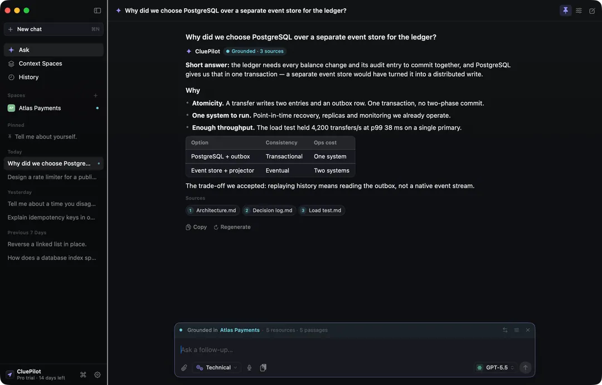
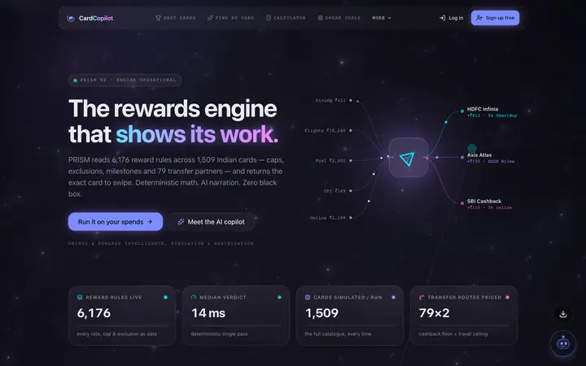
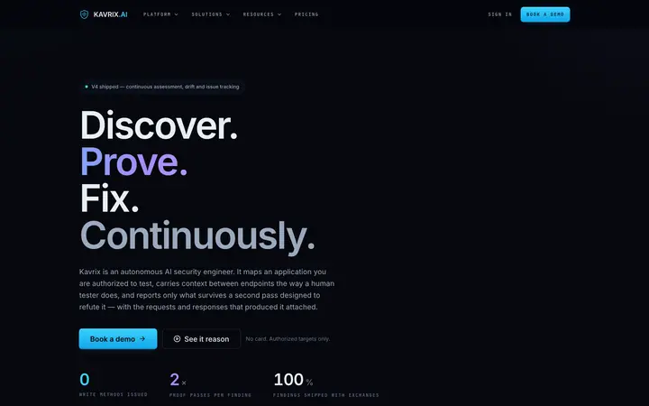
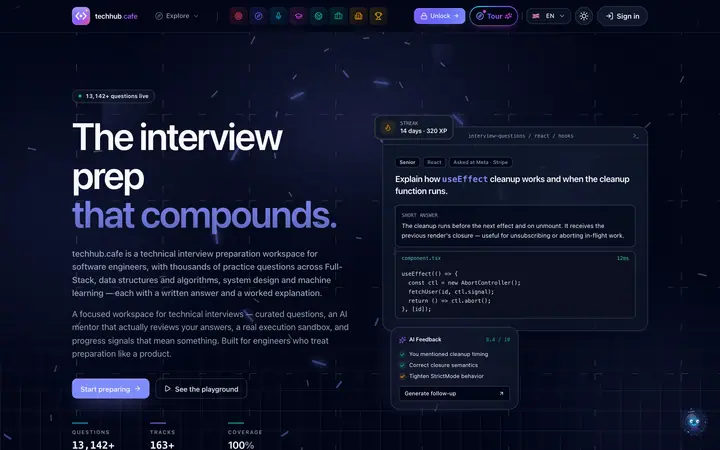
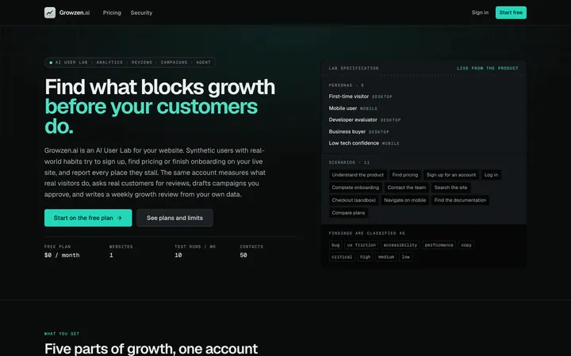
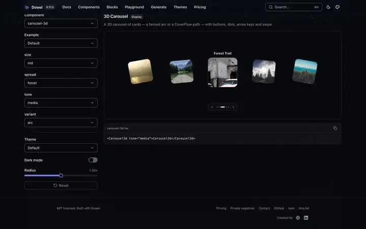
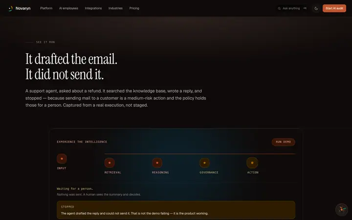
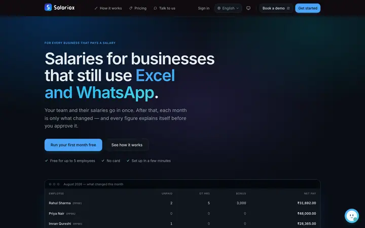
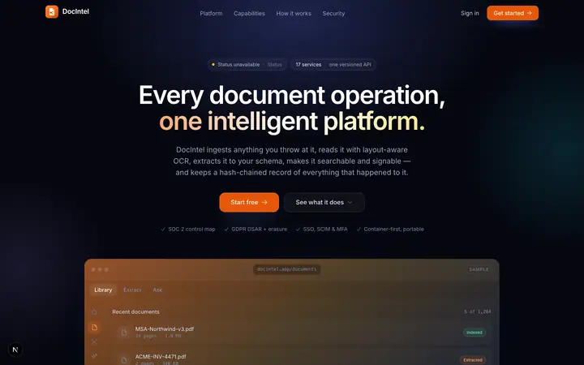

<div align="center">

<picture>
  <source media="(prefers-color-scheme: dark)" srcset="assets/hero-dark.svg">
  <source media="(prefers-color-scheme: light)" srcset="assets/hero-light.svg">
  
</picture>

<br>

<a href="https://techhub.cafe/me"></a> <a href="https://techhub.cafe/me/resume"></a> <a href="https://www.linkedin.com/in/aqadirkhan/"></a> <a href="mailto:aqadirkhan93@gmail.com"></a>


**AI engineer, forward deployed — I go where the problem lives and ship the system that solves it.**

<sub>Full Stack AI Engineer · Lead Software Engineer · Forward Deployed Engineer · 10+ years in production</sub>

</div>


## ◆ whoami


```yaml
role:     Full Stack AI Engineer · Lead Engineer · Forward Deployed
latest:   Senior Software Engineer @ Tractable AI (2025 — 2026)
          computer-vision model integration for AI vehicle inspection
led:      front-end for L’Oréal’s oneMediaTech @ Annalect · Omnicom
          Express monolith → FastAPI microservices on Kubernetes
on_site:  Volkswagen (Munich) · Emirates (Dubai)
builds:   tool-calling agents with human approval gates
          hybrid RAG with reranking + citation checks · LLM evals
          Indic voice pipelines · on-device models on Apple silicon
ships:    product → architecture → code → deploy → ops
open_to:  senior, lead & forward-deployed roles · freelance AI work
```


## ◆ Flagship — CluePilot.ai

<sub>Product · Signed DMG · paid checkout pending</sub>


<a href="https://techhub.cafe/me/work/cluepilot"></a>

**A native macOS interview-prep copilot — one keystroke, streamed answers, grounded in your own documents.**
A Swift 6 / SwiftUI menu-bar app summoned with ⇧⌘Space that streams answers from eight providers — including on-device Apple Intelligence and Ollama. Context Spaces add on-device retrieval over your résumé and notes; licensing is verified offline with Ed25519.

`Swift` `SwiftUI` `AppKit` `Next.js` `React` `Tailwind`

<a href="https://cluepilot-phi.vercel.app">Live&nbsp;↗</a> · <a href="https://techhub.cafe/me/work/cluepilot">Case&nbsp;study</a>


## ◆ Featured builds

<sub>Click a screenshot for the full case study — problem, architecture, trade-offs and evidence.</sub>


<table>
<tr>
<td width="50%" valign="top">
<a href="https://techhub.cafe/me/work/cardcopilot"></a>
<h3>CardCopilot</h3>
<sub><b>PRODUCT · MOBILE APP IN DEVELOPMENT</b></sub>
<p>India's credit-card rewards engine — deterministic maths, with an AI that is only allowed to narrate it.</p>
<p><code>Next.js</code> <code>React</code> <code>TypeScript</code> <code>Tailwind</code> <code>Prisma</code></p>
<p><a href="https://cardcopilot.in">Live&nbsp;↗</a> · <a href="https://techhub.cafe/me/work/cardcopilot">Case&nbsp;study</a></p>
</td>
<td width="50%" valign="top">
<a href="https://techhub.cafe/me/work/kavrix"></a>
<h3>Kavrix</h3>
<sub><b>PROTOTYPE · PRE-RELEASE 0.1.0 · NOT DEPLOYED</b></sub>
<p>Authorization-gated AI application security — it only reports findings it has re-verified with evidence.</p>
<p><code>Python</code> <code>FastAPI</code> <code>SQLAlchemy</code> <code>PostgreSQL</code> <code>Redis</code></p>
<p><a href="https://kavrix-web.onrender.com">Live&nbsp;↗</a> · <a href="https://techhub.cafe/me/work/kavrix">Case&nbsp;study</a></p>
</td>
</tr>
<tr>
<td width="50%" valign="top">
<a href="https://techhub.cafe/me/work/techhub"></a>
<h3>techhub.cafe</h3>
<sub><b>PRODUCT · IN PRODUCTION · ACTIVELY DEVELOPED</b></sub>
<p>An AI-assisted interview-prep and career platform — question bank, mock interviews, sandboxed coding and a recruiter portal.</p>
<p><code>Next.js</code> <code>React</code> <code>TypeScript</code> <code>Tailwind</code> <code>Supabase</code></p>
<p><a href="https://techhub.cafe">Live&nbsp;↗</a> · <a href="https://techhub.cafe/me/work/techhub">Case&nbsp;study</a></p>
</td>
<td width="50%" valign="top">
<a href="https://techhub.cafe/me/work/growzen"></a>
<h3>Growzen.ai</h3>
<sub><b>IN DEVELOPMENT · FEATURE-COMPLETE, PRE-LAUNCH</b></sub>
<p>AI growth platform: Claude-driven synthetic users test your site in a real browser, then an agent tells you what to fix.</p>
<p><code>Next.js</code> <code>React</code> <code>TypeScript</code> <code>Tailwind</code> <code>PostgreSQL</code></p>
<p><a href="https://growzen-6ygk.onrender.com">Live&nbsp;↗</a> · <a href="https://techhub.cafe/me/work/growzen">Case&nbsp;study</a></p>
</td>
</tr>
<tr>
<td width="50%" valign="top">
<a href="https://techhub.cafe/me/work/dowel"></a>
<h3>Dowel UI</h3>
<sub><b>PRODUCT · PUBLISHED ON NPM · V0.11</b></sub>
<p>A source-first React component library for SaaS and AI products — installed as code you own, readable by coding agents.</p>
<p><code>React</code> <code>TypeScript</code> <code>Tailwind</code> <code>Next.js</code> <code>Storybook</code></p>
<p><a href="https://dowel-eight.vercel.app">Live&nbsp;↗</a> · <a href="https://github.com/aqkprogrammer/dowel-ui">Code</a> · <a href="https://techhub.cafe/me/work/dowel">Case&nbsp;study</a></p>
</td>
<td width="50%" valign="top">
<a href="https://techhub.cafe/me/work/novaryn"></a>
<h3>Novaryn</h3>
<sub><b>PROTOTYPE · HOSTED IN DEMO MODE</b></sub>
<p>Self-hostable AI operations platform — governed agents, a workflow engine, RAG and human approvals.</p>
<p><code>Next.js</code> <code>React</code> <code>TypeScript</code> <code>Tailwind</code> <code>PostgreSQL</code></p>
<p><a href="https://novaryn-lyart.vercel.app">Live&nbsp;↗</a> · <a href="https://techhub.cafe/me/work/novaryn">Case&nbsp;study</a></p>
</td>
</tr>
<tr>
<td width="50%" valign="top">
<a href="https://techhub.cafe/me/work/salariax"></a>
<h3>Salariax</h3>
<sub><b>PRODUCT · PRE-LAUNCH · FREE-TIER HOST</b></sub>
<p>Payroll for Indian small businesses moving off Excel and WhatsApp — every figure traced to its arithmetic.</p>
<p><code>Next.js</code> <code>React</code> <code>TypeScript</code> <code>Tailwind</code> <code>PostgreSQL</code></p>
<p><a href="https://salariax.onrender.com">Live&nbsp;↗</a> · <a href="https://techhub.cafe/me/work/salariax">Case&nbsp;study</a></p>
</td>
<td width="50%" valign="top">
<a href="https://techhub.cafe/me/work/docintel"></a>
<h3>DocIntel</h3>
<sub><b>IN DEVELOPMENT · ADVANCED PROTOTYPE</b></sub>
<p>Enterprise document intelligence: storage, PDF toolkit, OCR, e-signature and a cited RAG assistant across 17 services.</p>
<p><code>Python</code> <code>FastAPI</code> <code>SQLAlchemy</code> <code>Celery</code> <code>PostgreSQL</code></p>
<p><a href="https://docintel.vercel.app">Live&nbsp;↗</a> · <a href="https://techhub.cafe/me/work/docintel">Case&nbsp;study</a></p>
</td>
</tr>
</table>


## ◆ AI systems & open source

<sub>Agents, gateways, evals, RAG and voice — the infrastructure under the products.</sub>


| Project | What it is | Status | Links |
|---|---|---|---|
| **LLM Gateway** | OpenAI-compatible proxy with fallback routing, circuit breakers, per-team budgets and full observability. | <sub>Demo · Open source</sub> | <a href="https://github.com/aqkprogrammer/llm-gateway">Code</a><br><a href="https://techhub.cafe/me/work/llm-gateway">Case&nbsp;study</a> |
| **LLM Eval Platform** | Evaluation and observability for LLM apps — from CI regression gates to live production scoring. | <sub>Demo · Open source · runs offline</sub> | <a href="https://github.com/aqkprogrammer/llm-eval-platform">Code</a><br><a href="https://techhub.cafe/me/work/llm-eval-platform">Case&nbsp;study</a> |
| **Agent Orchestrator** | LangGraph multi-agent system: a supervisor delegates to specialists, and risky actions pause for a human. | <sub>Demo · Open source · runs offline</sub> | <a href="https://github.com/aqkprogrammer/agent-orchestrator">Code</a><br><a href="https://techhub.cafe/me/work/agent-orchestrator">Case&nbsp;study</a> |
| **Hybrid RAG** | Question answering over internal docs with hybrid retrieval, reranking and citations verified after generation. | <sub>Demo · Open source · runs offline</sub> | <a href="https://github.com/aqkprogrammer/rag-hybrid-search">Code</a><br><a href="https://techhub.cafe/me/work/rag-hybrid-search">Case&nbsp;study</a> |
| **AI Software Factory** | An AI engineering team you can watch work — plan, code, test, fix and review agents streaming into a live office. | <sub>Demo · Hosted build runs a simulation</sub> | <a href="https://ai-software-factory-qadir-khan.vercel.app">Live&nbsp;↗</a><br><a href="https://github.com/aqkprogrammer/ai-software-factory">Code</a><br><a href="https://techhub.cafe/me/work/ai-software-factory">Case&nbsp;study</a> |
| **Latency Spike** | Measures speech-end to first-audio latency for a voice agent, hop by hop — and a fused endpointer that fixes the biggest hop. | <sub>Experiment · Open source spike</sub> | <a href="https://github.com/aqkprogrammer/latency-spike">Code</a><br><a href="https://techhub.cafe/me/work/latency-spike">Case&nbsp;study</a> |
| **aiplatform** | A Python framework of AI building blocks — a new product (“vertical”) is meant to be about 40 lines on top. | <sub>Experiment · Framework prototype</sub> | <a href="https://techhub.cafe/me/work/aiplatform">Case&nbsp;study</a> |
| **Swara** | Indic-first text-to-speech API built for telephone audio and Hinglish, priced in rupees. | <sub>Experiment · Pre-launch prototype</sub> | <a href="https://techhub.cafe/me/work/swara">Case&nbsp;study</a> |
| **IndicTurn & Voice Lab** | Voice-AI research: turn detection that doesn't cut off a “haan”, and a phone-line test bench for Indic speech models. | <sub>Experiment · Research on synthetic audio</sub> | <a href="https://techhub.cafe/me/work/indic-voice">Case&nbsp;study</a> |
| **Local LLM Chat** | A 27B-parameter Qwen model running fully offline on a 16 GB Apple Silicon Mac, with a streaming chat UI. | <sub>Experiment</sub> | <a href="https://techhub.cafe/me/work/local-llm-chat">Case&nbsp;study</a> |


## ◆ More AI products


| Project | What it is | Status | Links |
|---|---|---|---|
| **PayToRoast** | Paste a URL, get a specific, comedic and genuinely useful teardown of your website. First roast free. | <sub>Product · Deploy-ready · domain not live</sub> | <a href="https://paytoroast.vercel.app">Live&nbsp;↗</a><br><a href="https://techhub.cafe/me/work/paytoroast">Case&nbsp;study</a> |
| **ContractRisk (Contract AI)** | Clause-by-clause contract risk review with redlines — plus a citation-validated legal assistant for Indian law. | <sub>Prototype</sub> | <a href="https://contract-ai-seven-snowy.vercel.app">Live&nbsp;↗</a><br><a href="https://techhub.cafe/me/work/contract-ai">Case&nbsp;study</a> |
| **FinOpsGuard** | AWS cost optimisation: a rules engine finds waste, an LLM explains it to engineering, finance or the CEO. | <sub>Prototype · MVP</sub> | <a href="https://finopsguard-inky.vercel.app">Live&nbsp;↗</a><br><a href="https://techhub.cafe/me/work/finopsguard">Case&nbsp;study</a> |
| **Revio** | Vehicle ownership platform for India — garage, reminders, OCR document vault, marketplace and an AI copilot. | <sub>Prototype</sub> | <a href="https://revio-ten-zeta.vercel.app">Live&nbsp;↗</a><br><a href="https://techhub.cafe/me/work/revio">Case&nbsp;study</a> |
| **Branexa** | AI brand operating system: brief in, a scored vector logo system and a full brand kit out. | <sub>Prototype · Deploy config ready · not live</sub> | <a href="https://techhub.cafe/me/work/branexa">Case&nbsp;study</a> |
| **JARVIS** | Self-hosted multi-provider AI assistant platform — chat, RAG, agents, workflows and voice in one compose stack. | <sub>Prototype</sub> | <a href="https://techhub.cafe/me/work/jarvis">Case&nbsp;study</a> |
| **TruthLens AI** | Fake-news detection with a fine-tuned DistilBERT, confidence gauges and sentence-level suspicion highlights. | <sub>Demo</sub> | <a href="https://techhub.cafe/me/work/truthlens">Case&nbsp;study</a> |


<details>
<summary><b>Native macOS</b> — 6 builds</summary>

| Project | What it is | Status | Links |
|---|---|---|---|
| **Aether** | A local-first AI command centre for Apple Silicon — model, speech and memory all on the device. | <sub>Prototype · Phases 0–5 built</sub> | <a href="https://techhub.cafe/me/work/aether">Case&nbsp;study</a> |
| **Vision** | On-device face recognition for Mac and Chrome — unlock with a glance, lock when you walk away. | <sub>Demo · Independent re-implementation</sub> | <a href="https://techhub.cafe/me/work/vision">Case&nbsp;study</a> |
| **Hangly** | Digital charms that swing from the top of your screen with real rope physics — Mac app and Chrome extension. | <sub>Demo · Independent re-implementation</sub> | <a href="https://techhub.cafe/me/work/hangly">Case&nbsp;study</a> |
| **DeskPal** | A desktop companion that walks onto your screen and asks if you drank water — macOS menu-bar app. | <sub>Demo · Reel recreation</sub> | <a href="https://techhub.cafe/me/work/deskpal">Case&nbsp;study</a> |
| **FlyBy** | Meeting reminders that fly across your screen on a little pink jet — macOS menu-bar app. | <sub>Demo · Reel recreation</sub> | <a href="https://techhub.cafe/me/work/flyby">Case&nbsp;study</a> |
| **WebHang** | A character hangs from a web at the top of your screen and swings over your work — macOS overlay. | <sub>Demo · Reel recreation</sub> | <a href="https://techhub.cafe/me/work/web-hang">Case&nbsp;study</a> |

</details>


<details>
<summary><b>Interactive & gesture lab</b> — 12 builds</summary>

| Project | What it is | Status | Links |
|---|---|---|---|
| **Demos Platform** | A registry-driven hub for the interactive demos, and @demos/vision — a shared hand-tracking runtime extracted from five apps. | <sub>In development · Porting in progress</sub> | <a href="https://demos-platform.vercel.app">Live&nbsp;↗</a><br><a href="https://techhub.cafe/me/work/demos-platform">Case&nbsp;study</a> |
| **Gesture Arena** | A browser arcade of eight games played entirely with hand gestures — no controller. | <sub>Demo</sub> | <a href="https://gesture-arena-neon.vercel.app">Live&nbsp;↗</a><br><a href="https://techhub.cafe/me/work/gesture-arena">Case&nbsp;study</a> |
| **AIR MUSIC** | Play piano, drums, DJ decks and a rhythm game in the air — webcam in, Web Audio out. | <sub>Demo</sub> | <a href="https://hand-piano-nine.vercel.app">Live&nbsp;↗</a><br><a href="https://techhub.cafe/me/work/air-music">Case&nbsp;study</a> |
| **Air Wheel** | Steer a racing game with an imaginary wheel held between your hands. | <sub>Demo</sub> | <a href="https://air-wheel.vercel.app">Live&nbsp;↗</a><br><a href="https://techhub.cafe/me/work/air-wheel">Case&nbsp;study</a> |
| **Bloom** | A 3D garden you plant, light, pollinate and prune with hand gestures. | <sub>Demo</sub> | <a href="https://bloom-garden-ivory.vercel.app">Live&nbsp;↗</a><br><a href="https://techhub.cafe/me/work/bloom">Case&nbsp;study</a> |
| **Aviary** | A butterfly flock in a containment box you resize and rotate with two hands. | <sub>Demo</sub> | <a href="https://gesture-aviary.vercel.app">Live&nbsp;↗</a><br><a href="https://techhub.cafe/me/work/aviary">Case&nbsp;study</a> |
| **LUDOVERSE** | Classic Ludo, reimagined — a deterministic, replayable engine with bots, five modes and progression. | <sub>Demo · Single-device play</sub> | <a href="https://ludoverse-dun.vercel.app">Live&nbsp;↗</a><br><a href="https://techhub.cafe/me/work/ludoverse">Case&nbsp;study</a> |
| **OTP Slingshot** | OTP verification as a physics toy: load a digit, pull back, fire it into the code. | <sub>Demo</sub> | <a href="https://otp-slingshot.vercel.app">Live&nbsp;↗</a><br><a href="https://github.com/aqkprogrammer/otp-slingshot">Code</a><br><a href="https://techhub.cafe/me/work/otp-slingshot">Case&nbsp;study</a> |
| **Receipt Printer** | A three-step checkout that ends in a thermal receipt you feed out and tear off. Zero dependencies. | <sub>Demo</sub> | <a href="https://receipt-printer-tau.vercel.app">Live&nbsp;↗</a><br><a href="https://github.com/aqkprogrammer/receipt-printer">Code</a><br><a href="https://techhub.cafe/me/work/receipt-printer">Case&nbsp;study</a> |
| **Orbit Cards** | A 3D wallet interface: eight cards on a spinnable ring, with four layouts and a detail view. | <sub>Demo</sub> | <a href="https://orbit-cards-seven.vercel.app">Live&nbsp;↗</a><br><a href="https://techhub.cafe/me/work/orbit-cards">Case&nbsp;study</a> |
| **Vault** | A password-strength meter where the lock upgrades as you type: paperclip, padlock, deadbolt, bank vault. | <sub>Demo · Reel recreation</sub> | <a href="https://vault-meter.vercel.app">Live&nbsp;↗</a><br><a href="https://techhub.cafe/me/work/vault-meter">Case&nbsp;study</a> |
| **Hanging Cards** | A conference badge on a lanyard you can grab, toss, flip and rack — with rope physics and sound. | <sub>Demo · Reel recreation</sub> | <a href="https://hanging-cards.vercel.app">Live&nbsp;↗</a><br><a href="https://techhub.cafe/me/work/hanging-cards">Case&nbsp;study</a> |

</details>


<details>
<summary><b>Product & design studies</b> — 7 builds</summary>

| Project | What it is | Status | Links |
|---|---|---|---|
| **Kagaz** | Wedding-invitation websites for South Asian weddings — 18 designs, cinematic openings and one-tap RSVP. | <sub>Prototype · Front-end MVP · mocked persistence</sub> | <a href="https://kagaz-nine.vercel.app">Live&nbsp;↗</a><br><a href="https://techhub.cafe/me/work/kagaz">Case&nbsp;study</a> |
| **Vanilla Studio** | An editorial storefront concept for a women's fashion boutique, engineered for speed. | <sub>Demo · Mock catalogue · no checkout</sub> | <a href="https://vanilla-studio.vercel.app">Live&nbsp;↗</a><br><a href="https://techhub.cafe/me/work/vanilla-studio">Case&nbsp;study</a> |
| **Mirror IX** | A fashion storefront where you stack vector garments on a model, then hand the look to Gemini to render. | <sub>Demo</sub> | <a href="https://mirror-nine-mauve.vercel.app">Live&nbsp;↗</a><br><a href="https://techhub.cafe/me/work/mirror-nine">Case&nbsp;study</a> |
| **NOVA BREW** | A scroll-driven sci-fi coffee configurator with a live holographic cup. | <sub>Demo</sub> | <a href="https://nova-brew.vercel.app">Live&nbsp;↗</a><br><a href="https://techhub.cafe/me/work/nova-brew">Case&nbsp;study</a> |
| **Lumen Atelier** | A lighting catalogue where every fixture is procedural SVG that actually lights up with the time of day. | <sub>Demo</sub> | <a href="https://lumen-atelier-nu.vercel.app">Live&nbsp;↗</a><br><a href="https://techhub.cafe/me/work/lumen-atelier">Case&nbsp;study</a> |
| **Sartor** | The anatomy of a suit — an exploded technical plate driven by scroll, and a cloth configurator drawn thread by thread. | <sub>Demo</sub> | <a href="https://sartor-protocol.vercel.app">Live&nbsp;↗</a><br><a href="https://techhub.cafe/me/work/sartor">Case&nbsp;study</a> |
| **Crema Club** | An editorial site for a fictional gelateria, with a cone builder that prices your order. | <sub>Demo</sub> | <a href="https://crema-club-phi.vercel.app">Live&nbsp;↗</a><br><a href="https://techhub.cafe/me/work/crema-club">Case&nbsp;study</a> |

</details>


<details>
<summary><b>Client work & engineering assessments</b> — 4 builds</summary>

| Project | What it is | Status | Links |
|---|---|---|---|
| **SearchMyGuide** | A three-sided travel marketplace — travellers book local guides, guides run their business, admins run the platform. | <sub>Client · Deployed · pre-launch</sub> | <a href="https://searchmyguide.com">Live&nbsp;↗</a><br><a href="https://techhub.cafe/me/work/searchmyguide">Case&nbsp;study</a> |
| **Faiz DTF & UV Printing** | Marketing site for a Lucknow print shop that turns visitors into WhatsApp quote requests — with zero image assets. | <sub>Client · Pre-launch</sub> | <a href="https://faiz-web.vercel.app">Live&nbsp;↗</a><br><a href="https://techhub.cafe/me/work/faiz-web">Case&nbsp;study</a> |
| **SkillGraph** | Career skill and learning-path explorer on a property graph — multi-hop openCypher over Bolt. Built for Wexa.ai. | <sub>Assessment · Wexa.ai take-home</sub> | <a href="https://github.com/aqkprogrammer/skillgraph">Code</a><br><a href="https://techhub.cafe/me/work/skillgraph">Case&nbsp;study</a> |
| **Clinical Snapshot** | A one-page clinical summary from a deliberately messy FHIR R4 bundle — correctly uncertain by design. | <sub>Assessment · Health-tech take-home (24h)</sub> | <a href="https://github.com/aqkprogrammer/clinical-snapshot">Code</a><br><a href="https://techhub.cafe/me/work/clinical-snapshot">Case&nbsp;study</a> |

</details>


## ◆ Experience


| When | Role | Where |
|---|---|---|
| 2025 — 2026 | **Senior Software Engineer** · Tractable AI | Noida, India |
| 2021 — 2025 | **Lead Software Engineer** · Annalect · Omnicom | Gurgaon, India |
| 2022 — 2023 | **On-site Engineer** · Volkswagen · EOL | Munich, Germany |
| 2020 — 2021 | **Software Developer** · Dyninno Group | Gurgaon, India |
| 2019 — 2020 | **Software Engineer** · Emirates · Dew Solutions | Dubai, UAE |
| 2016 — 2019 | **Software Engineer** · CoderSoft · Halwits | Gurgaon · Lucknow |


## ◆ Toolkit


<p align="center">
  <br>
  
</p>

<p align="center"><sub><b>AI</b> — LLM agents (LangGraph, tool calling) · hybrid RAG (pgvector, Qdrant, ChromaDB) · evals & observability · speech (Deepgram, ElevenLabs, LiveKit) · on-device (MLX, Core ML) · computer vision (MediaPipe)</sub></p>


## ◆ Activity


<picture>
  <source media="(prefers-color-scheme: dark)" srcset="assets/activity-dark.svg">
  <source media="(prefers-color-scheme: light)" srcset="assets/activity-light.svg">
  
</picture>


---

<div align="center">

### Have a hard problem worth solving?

I typically reply within 48 hours, IST-friendly.

<a href="https://techhub.cafe/me#contact"></a> <a href="https://medium.com/@aqkprogrammer"></a> <a href="https://www.instagram.com/aqkprogrammer/"></a>

<sub>Every project above has a case study at <a href="https://techhub.cafe/me">techhub.cafe/me</a> — 55 builds, each labelled for exactly what it is.</sub>

</div>
